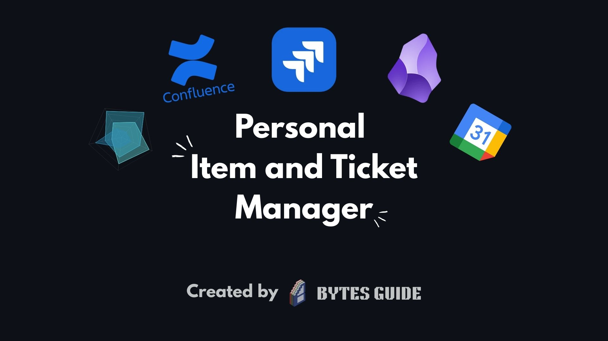
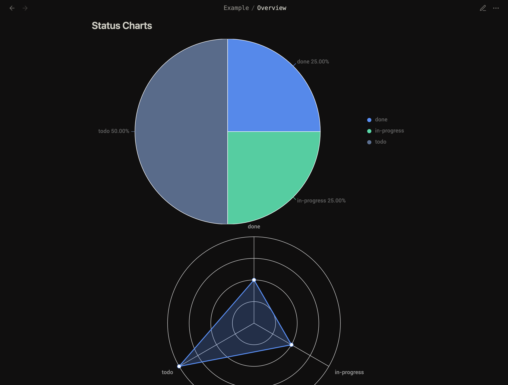
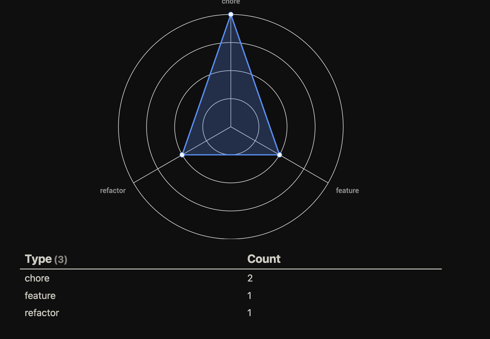
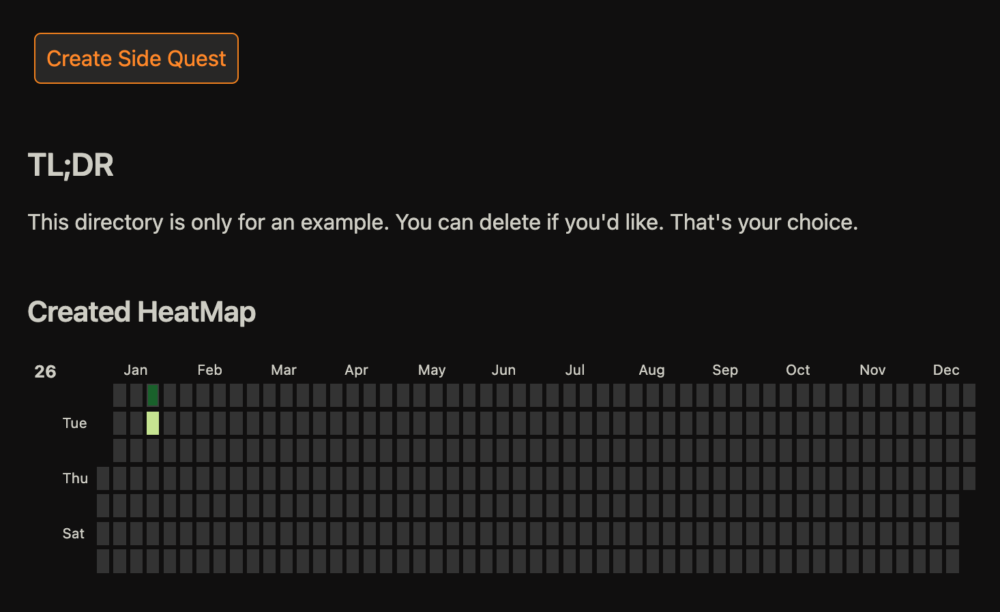

# Personal Ticket Manager for Obsidian 📖

> [!WARNING]
> I have only tested this template on Linux and MacOS. Windows has not been tested, for any issues please refer to the `Contributing` section.

## What's This About? 🤔

This is a personal ticket manager for those who find organization in making Jira tickets for themselves, but don't want the hassle of setting up Jira Cloud or Confluence. 

**Why use this?**
- ✨ This gives you full control over the tickets, as everything is stored locally and as markdown files
- 🔌 Integration with other Plugins from Obsidian
- 🚀 This is primarily designed for small personal software projects, but can be used for other aspects

**What I'm using it for:**
- 📅 Organizing my 2026 year 
- 💻 And small projects

It's your life gng, use it however you want!

## What's Going On Here? 📂

### Templates Folder

- [[new_project_template]] 🏗️ - This file is what scaffolds your project. It will create a new folder at the root and make the `quest log` for adding your tickets and an `Overview` file for viewing some stats and what not.

- [[ticket_template]] 🎟️ - This is the template that the ticket items are implementing. When you make a new ticket through the Overview file, it will create a note following this template in the `quest log`.

## Installation 📥

### Step 1: Create Your Project Directory

Run your OS version of creating a new directory. For me that would be:

```bash
mkdir example-project
```

### Step 2: Navigate Into The Directory

```bash
cd example-project
```

### Step 3: Clone The Repo

```bash
git clone https://github.com/vincent-buchner/obsidian-personal-ticket-manager.git .
```

**Don't forget the period at the end** - that puts the project content in the current folder!

### Step 4: Open Up Obsidian

Depending on where you are, it may be different:

- **If you are in one of your vaults**: Go to the lower left corner and click on your vault name with the two arrows facing up and down, then click **Manage Vaults**
- **If you're not in a vault already**: You should already see the **Open folder as vault** option

Click **Open folder as vault** and navigate to your `example-project` directory.

### Step 5: Trust The Plugins

Obsidian will ask you if you trust the plugins and author from this clone. Please feel free to review the **Plugins Used** section for more context. I tried to use some of the better known packages, no sneaky sh*t.

That's it! You're good to go 🎉

## Creating a New Project 🚀

### Starting Your Project Folder Structure

- To create a new project, click the **Templater icon** on the left hand side (looks like \<\%)
- You will have two options: **Create new project template** and **ticket template**
- Click on **Create new project template** to scaffold out your new project

This will set up your quest log and overview file, and you'll be ready to start tracking tickets!

## Getting Template Updates 🔄

### Enable the Git Plugin First

Before you can pull updates, you need to install the Git plugin:

1. Go to **Settings** → **Community plugins** → **Enable Git**
### Pulling Updates

**Step 1: Save Your Work**
- Open Command Palette (`Ctrl/Cmd + P`)
- Run **"Obsidian Git: Commit all changes"**
- Add a message like "Local updates before pull"

**Step 2: Pull the Updates**
- Open Command Palette again
- Run **"Obsidian Git: Pull"**
- The plugin will fetch and merge changes from the template repo

**Step 3: Handle Conflicts (if they happen)**
- If conflicts occur, the plugin will notify you
- Open the conflicted files (they'll be marked in Obsidian)
- Look for the `<<<<<<<` sections and resolve them manually
- Commit the resolutions via the plugin
- Run "Obsidian Git: Pull" again if needed

### Auto-Update (Optional) ⚙️

Want hands-off updates? Enable auto-pull in the plugin settings (Settings → Obsidian Git):
- Set it to pull on startup or at intervals
- **Warning**: This could interrupt your work if conflicts pop up, so use with caution
## Setting Up Your Personal Repo 🔗

I honestly had a whole section outlined here on here to set this up, but this article does it so much better: [Create a private fork of a public repository](https://gist.github.com/0xjac/85097472043b697ab57ba1b1c7530274)

> [!WARNING]
> When doing this, I would recommend disabling the Git plugin and then enabling again after the merge is complete. Push your changes to you private remote, then enable the Git plugin.

## Some Requirements ⚙️

### Configuring Incremental ID

Prior to creating a new project, you need to go into the settings to configure a new Incremental ID for your project:

How I have it setup in the example is to use the "EX" prefix at the beginning, like how it's defined in the front matter metadata. The thing that kinda sucks and what you'll have to do manually is define this in the plugin. This is how you do it:

1. Go into **Settings** → **Community Plugins**
2. Go down til you see **Incremental ID**
3. Click the settings icon for the plugin
4. There you'll see a table where you can add your prefix and increment settings
5. Then return back here and put your prefix in the frontmatter

**Example**: The example uses "EX" as the prefix (e.g., EX-001, EX-002, etc.)

Kinda sucks I know, but it is what it is 🤷

## Check Out The Example 👀

You can preview the **Example** folder. This was made using the `new_project_template`.

## Plugins Used 🔌

Make sure to install and enable these plugins before using the template:

- [**Buttons**](https://github.com/shabegom/buttons) by shabegom
- [**Charts View**](https://github.com/caronchen/obsidian-chartsview-plugin) by caronchen
- [**Dataview**](https://github.com/blacksmithgu/obsidian-dataview) by blacksmithgu
- [**Heatmap Calendar**](https://github.com/Richardsl/heatmap-calendar-obsidian) by Richardsl
- [**Iconize**](https://github.com/FlorianWoelki/obsidian-iconize) by FlorianWoelki
- [**Incremental ID**](https://github.com/adziok/obsidian-incremental-id) by Adziok
- [**Templater**](https://github.com/SilentVoid13/Templater) by SilentVoid13
- [**Vimrc Support**](https://github.com/esm7/obsidian-vimrc-support) by Esm7

## Gallery 📸






## Road Map 🗺️

- [ ] Kanban Board Support
- [ ] Toggl Plugin Integration
- [ ] Google Calendar Integration
- [ ] AI Assistance
- [ ] More custom prompts for each project

## Contributing 🤝

Contributions, issues, and feature requests are welcome!
